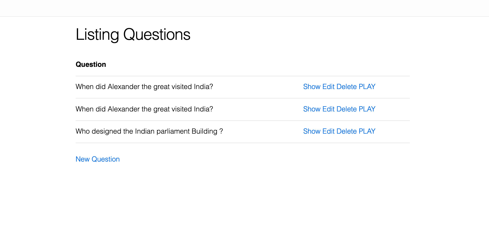
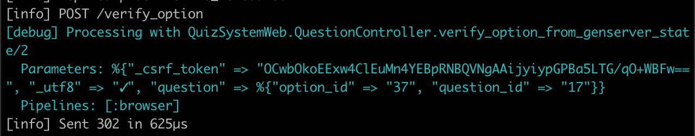
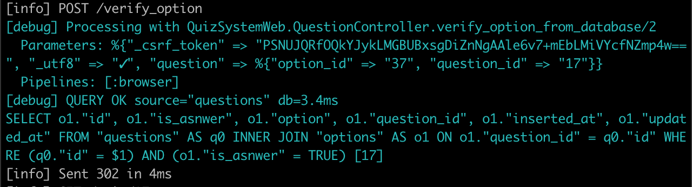

# QuizSystem

To start your Phoenix server:

  * Install dependencies with `mix deps.get`
  * Create and migrate your database with `mix ecto.setup`
  * Install Node.js dependencies with `cd assets && npm install`
  * Start Phoenix endpoint with `mix phx.server`
  * seed your database for example questions `mix run priv/repo/seeds.exs`
  
Now you can visit [`localhost:4000/questions`](http://localhost:4000/questions) from your browser.

* Visit "/questions" for quiz questions
   
      
* There are two ways to verify the option which user given 
  * verify user submitted option from genserver state we get response in micro seconds 
     
    
  * verfiy user submitted option from database 
    

<!-- * initilizing a genserver called Quiz_Server with questions and option ids in the database with following format
  * `[%{"question_id" => "right_option_id"]` -->

<!-- Ready to run in production? Please [check our deployment guides](https://hexdocs.pm/phoenix/deployment.html).

## Learn more

  * Official website: http://www.phoenixframework.org/
  * Guides: https://hexdocs.pm/phoenix/overview.html
  * Docs: https://hexdocs.pm/phoenix
  * Mailing list: http://groups.google.com/group/phoenix-talk
  * Source: https://github.com/phoenixframework/phoenix -->
